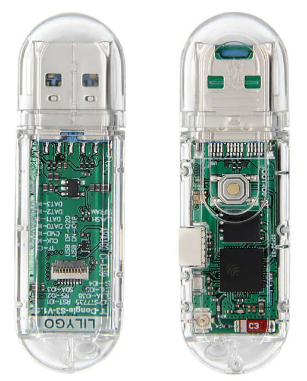
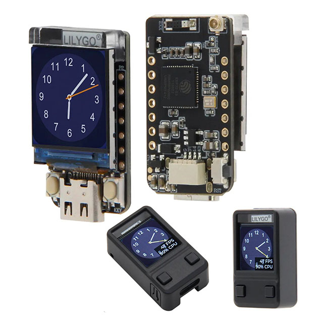
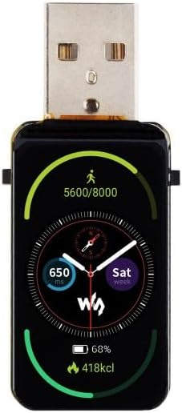
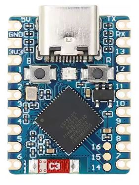
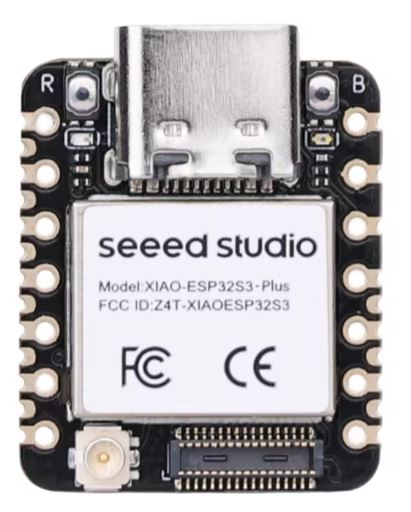

# Supported Hardware

| Hardware |  Reference |
|---------|-------|
| **LilyGO S3 T-Dongle (with screen)**    ESP32-S3 USB-A dongle with integrated TFT display and status LED.   Primary reference and development platform.  Approx. price: $15+ |  |
| **LilyGO S3 T-Dongle (no screen)**    ESP32-S3 USB-A dongle without display.   Approx. price: $10+ |  |
| **LilyGO ESP32-S3 T-QT**    Compact ESP32-S3 board with small integrated TFT display and USB-C.   Suitable for minimal on-device UI, status, or QR-based setup flows.   Approx. price: $12+ |  |
| **Waveshare ESP32-S3 1.47\" Display**    ESP32-S3 board with 1.47\" LCD and USB-C.    Approx. price: $20+ |  |
| **Waveshare ESP32-S3 Zero**    Minimal ESP32-S3 USB-C board in a compact form factor.    Approx. price: $5+ |  |
| **Seeed Studio XIAO ESP32-S3**    Ultra-compact ESP32-S3 module with USB-C.    Approx. price: $7+ |  |
---

### Notes

**Most ESP32-S3 boards are supported in “dark mode”** (no screen, no LED).  
If your specific board firmware is not avilable in the release, flash the generic firmware release - ie  **bluekb_firmware_v2.1.0_esp32s3_generic_dark.bin**

After flashing, follow the instructions for **setting up a device without a screen** as described in the documentation.

