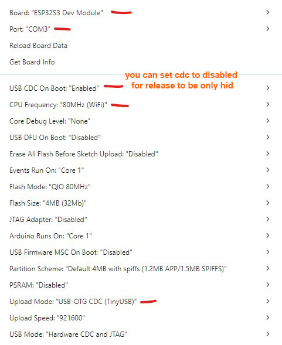

# ESP32-S3 Password/Keyboard Input Dongle (USB HID)

## Overview

This project is a quick prototype of a tool that makes it easier to send passwords from a mobile password vault app to a PC or device **without having to type them manually**.  

It works as a **USB HID keyboard emulator** running on an ESP32-S3 dongle. The dongle receives keystrokes over Bluetooth and then "types" them on the connected host machine.

⚠️ **Disclaimer:** This project is experimental. While basic testing has been done, bugs or quirks are likely. Contributions and improvements are welcome.

---
## 🔧 Installation & First-Time Setup (v1.2.1+)

### 📥 Firmware Installation

Precompiled firmware is available under **[Releases](https://github.com/larrylart/blue_keyboard/releases)**.

1. Open **[esptool-js](https://espressif.github.io/esptool-js/)** in your browser.  
2. Connect the dongle via USB **while holding the back button** to enter bootloader mode.  
3. Flash the provided firmware binary at **address `0x0`**.


4. Wait until esptool-js finishes (it takes about 2 minute to write and verify). when done you should see something like this at the bottom


Alternative flashing tools:  
- LilyGO **T-Dongle-S3 firmware tools** (not tested):  
  https://github.com/Xinyuan-LilyGO/T-Dongle-S3/tree/main/firmware

---

## 🛠️ First Boot Setup (Wi-Fi AP Mode)

From **v1.2.1**, a fresh device (or after factory reset) no longer enters BLE immediately.  
Instead, it starts a Wi-Fi configuration portal.

### 1️⃣ Dongle Starts in Wi-Fi AP Mode  

On first boot the firmware if not configured, it:

- Starts a Wi-Fi Access Point: **`BLUKBD-XXXX`** (XXXX = last 2 bytes of MAC).  
- Shows the **random AP password** on the TFT screen.  
- Starts a small HTTP server + DNS captive portal on **`192.168.4.1`**.

### 2️⃣ Connect to the AP

On your phone/or pc:

- Scan for Wi-Fi → connect to **BLUKBD-XXXX** using the password shown on the dongle screen. Once connected the dongle will show the it's IP address on the screen - 192.168.4.1
- The dongle attempts to auto-redirect you to the setup page, however that does not seem to work properly on some OS. If it doesn't redirect, open this in a browser: http://192.168.4.1

### 3️⃣ Configure the Dongle

On the setup page, configure:

- **Bluetooth Name** – the name shown during BLE scanning. You can replace the default with your own Bluetooth name, useful if you have multiple dongles.  
- **Host Keyboard Layout** – the layout of the PC/Mac the dongle types into. you will be able to change that at a latter stage as well, in the app.  
- **Setup Password** – used to derive the PBKDF2 verifier for secure AppKey onboarding  


Press **Save**, and the dongle will:

- Store all values in NVS  
- Generate the AppKey  
- Mark setup as complete  
- Reboot into **normal BLE + USB HID mode** - 
- Disable Wi-Fi and setup services permanently  

### 📲 Pairing with KeePassDX-kb (v1.2.1+)

1. In **KeePassDX-kb**, open:  
   **Settings → Output Devices → Select your dongle → Pair**
   Note: If pairing is advertised in the KeePassDX before you get into the **Settings → Output Devices** screen, cancel as the initial provisioning setup needs to be done in the output settings.

2. The app will connect and request the **setup password** you configured.  
   If the prompt doesn’t appear immediately, toggle connect/disconnect once.


3. After the password is verified and the AppKey is provisioned, the dongle is fully paired and ready for normal use.
   Note: if the dongle disconnects after provisioning, that is due to a bug I have not yet managed to track down. You can fix this by re-opening the app, than manually toggle the dongle connection from settings. This only seems to be happening on the initial connection.  

---
### 🔄 Update **v1.2.2** 
- Fast Keys Support - The dongle now implements the new fast-key HID command mode.
- The release package also includes the BluKeyborg Android companion app for general text sending and testing.

### 🔄 Update **v1.2.1 – Binary MTLS + Wi-Fi Setup Portal**

- 🔐 **New binary MTLS protocol (PROTO 1.2)**  
  - Per-session ECDH P-256 key exchange  
  - Session key derived via HKDF-SHA256, salted with the long-term AppKey  
  - AES-CTR encryption for all application payloads  
  - HMAC-SHA256 (truncated) for integrity  
  - Per-direction sequence numbers and session IDs for replay protection  
  - Implements binary framed commands (`B0/B1/B2/B3/etc`).

- 🌐 **First-run Wi-Fi setup portal**  
  - On initial boot or after factory reset, the dongle starts a Wi-Fi AP (`BLUKBD-XXXX`) and shows the password on the TFT.  
  - A captive web portal at `http://192.168.4.1/` lets you configure:
    - BLE name  
    - Host keyboard layout (e.g. `UK_WINLIN`, `IE_WINLIN`, `US_MAC`, etc.)  
    - A setup password, used later to derive a PBKDF2-SHA256 verifier for secure AppKey onboarding.

- 🔑 **Secure AppKey onboarding**  
  - The AppKey is not sent or stored in plain form.  
  - The Android client uses the setup password to:
    - Re-derive a PBKDF2-HMAC-SHA256 verifier from salt + iteration count returned by the dongle  
    - Perform a challenge/response HMAC check  
    - Receive an AES-CTR encrypted AppKey blob with HMAC integrity  
  - The AppKey is then stored only on the dongle (NVS) and the client app (e.g. in Android Keystore).

- 🧩 **Binary application protocol under MTLS**  
  - Layout switching, info queries, resets and string sends are now carried in encrypted frames:
    - `OP | LEN_lo | LEN_hi | PAYLOAD`
  - Important opcodes (inside MTLS):
    - `0xC0` – SET_LAYOUT  
    - `0xC1` – GET_INFO → `0xC2` INFO_VALUE  
    - `0xC4` – RESET_TO_DEFAULT (clears AppKey + setup flags so Wi-Fi portal runs again)  
    - `0xD0` – SEND_STRING → `0xD1` SEND_RESULT (status + MD5 of received payload bytes).

- 🧠 **Improved layout & typing engine**  
  - Layouts centralized in `layout_kb_profiles.h`.  
  - Layout names like `UK_WINLIN`, `IE_WINLIN`, `US_WINLIN`, `DE_WINLIN`, `FR_MAC`, etc.  
  - Layout-aware Unicode → HID mapping for more reliable typing.

## Hardware

- **Board:** [LILYGO® T-Dongle-S3 ESP32-S3 TTGO Development Board](https://github.com/Xinyuan-LilyGO/T-Dongle-S3)  
  - Features: 0.96" ST7735 LCD display, TF card slot, onboard LED  
  - Price: ~$30 on Amazon, ~$17 on AliExpress
    

---

## How It Works (High-Level)

1. Connect the dongle to your computer via USB.  
   - The dongle enumerates as a USB HID keyboard.  
   - The TFT typically shows a status like "READY".

2. On your phone, open **KeePassDX-kb** (modified KeePassDX build)  
   - In KeePassDX-kb, configure the "output device" as the Blue Keyboard dongle.  
   - Pair the phone and dongle if not already paired.

3. From KeePassDX-kb 
   - The phone uses BLE to connect to the dongle.  
   - Starting from v1.2.1, it performs:
     - AppKey onboarding (once per device) if needed
     - A binary MTLS handshake on top of BLE
   - Afterwards it sends an encrypted SEND_STRING command.

4. The dongle:
   - Decrypts and validates the command using MTLS
   - Converts the characters to HID keycodes using the selected layout profile
   - Types the characters to the host as keypress events
   - Sends a response with an MD5 of the received payload so the app can verify that everything was emitted correctly.

---

## Layout-Aware Typing

The dongle supports multiple keyboard layouts, especially around `WINLIN` (Windows/Linux) and `MAC` variants.

Internally:

- Layout configurations are stored and managed in `layout_kb_profiles.h`.
- Each profile defines how characters map to HID scan codes and modifiers.
- Some keys (like `@`, `"`, `€`, etc.) differ between layouts, so they are handled via per-layout rules instead of hardcoded ASCII mappings.

The app can ask the dongle to:

- **Set a layout** (e.g. `UK_WINLIN`, `IE_WINLIN`, `US_WINLIN`, etc.)
- **Query current layout / info** (useful for diagnostics).

With the move to v1.2.1, these operations now use the **binary MTLS-protected opcodes**:

- `0xC0` – SET_LAYOUT  
- `0xC1` – GET_INFO  
- `0xC2` – INFO_VALUE (response)

---

## Security Model (Conceptual)

At a very high level:

1. **BLE Link Layer**  
   - BLE link encryption + bonding is used for basic link security (prevents casual eavesdropping).

2. **Application MTLS Layer (v1.2.1)**  
   - On top of BLE, a binary "micro-TLS" (MTLS) layer protects all application data:
     - AppKey-based HMAC and HKDF
     - ECDH P-256 key exchange
     - AES-CTR encryption
     - HMAC authentication
     - Sequence-based replay protection

3. **Host Computer**  
   - The host sees a standard USB keyboard, with no special drivers or software.  
   - The security assumption is that the dongle is trusted and the PC treats it as a local keyboard.

4. **Phone / App**  
   - The Android app manages the KeePass database and holds the AppKey.  
   - Sensitive data never needs to be stored or synced on the host computer.

---

## First-Run Setup (Wi-Fi AP + Web Portal)

From v1.2.1, the very first boot (or after factory reset) no longer drops directly into BLE.  
Instead, the dongle enters Wi-Fi setup mode:

1. Checks an NVS flag to see if setup has been completed.
2. If not, starts a Wi-Fi Access Point (SSID like `BLUKBD-XXXX`) and prints the randomly generated password on the TFT.
3. Runs a tiny HTTP server + DNS captive portal on `192.168.4.1`.
4. Presents a first-run page where you can configure:
   - BLE device name (used during BLE scanning and pairing)
   - Host keyboard layout (the layout of the PC the dongle is plugged into)
   - A setup password used to derive the PBKDF2 verifier for AppKey onboarding.

After saving, the dongle stores all values in NVS, generates an AppKey, marks setup as done and reboots into normal BLE + HID mode.

---

## AppKey Onboarding (One-Time per Client Device)

The setup password is never stored on the dongle in clear.  
Instead, the firmware stores a PBKDF2-HMAC-SHA256 verifier (plus salt and iteration count) and uses a small challenge/response protocol so the Android app can securely obtain the AppKey:

1. App asks user for the setup password.
2. App sends `A0` (GET_APPKEY_REQUEST).
3. Dongle replies with `A2` (CHALLENGE) containing:
   - PBKDF2 salt
   - PBKDF2 iteration count
   - Random challenge value.
4. App recomputes PBKDF2 locally and sends an HMAC proof in `A3` (APPKEY_PROOF).
5. If valid, the dongle encrypts its internal AppKey with AES-CTR, appends an HMAC, and returns it in `A1` (WRAPPED_APPKEY).
6. The app verifies and decrypts the payload and stores the AppKey on its side.

After this, both sides share the same AppKey without ever sending it in clear.

---

## MTLS Handshake & Binary Protocol

Once both sides know the AppKey, every BLE connection uses a binary MTLS handshake:

- `B0` – HELLO (dongle → app), contains server ECDH public key + session ID.
- `B1` – KEYX (app → dongle), contains client ECDH public key + HMAC(AppKey, ...).
- `B2` – SFIN (dongle → app), confirms the session key derived from ECDH + AppKey via HKDF.

All subsequent traffic is carried in `B3` records:

- Context-specific IVs derived from the session key, session ID, direction and sequence number.
- Encrypted inner frame: `OP | LEN | PAYLOAD` (application command).
- HMAC-SHA256 (truncated) for integrity.
- Strict sequence number checks for replay protection.

On top of this, the application opcodes handle layout switching, info queries, resets and string sending as described in the v1.2.1 section above.

---

## Integration with Password Vaults

A modified KeePassDX client for Android has been created:  
- Repo: [KeePassDX-kb](https://github.com/larrylart/KeePassDX-kb)  
- Includes an **unsigned APK** for manual install and testing.  
- Notes:
  - Only lightly tested.  
  - Known quirks: sometimes fails to connect or send. Restart KeePassDX if this happens.  

---

## Development Setup (Arduino IDE)

### Requirements

- **ESP32 Board Library**: `3.3.1+`  
- Additional libraries:
  - `Adafruit_SPIFlash`
  - `FastLED`
  - `NimBLE-Arduino`
  - `TFT_eSPI` (customized)



### TFT Screen

- The stock `TFT_eSPI` in Arduino IDE did not work out of the box  
- You need to get the one provided by LilyGO:  
  - [T-Dongle-S3 libs](https://github.com/Xinyuan-LilyGO/T-Dongle-S3/tree/main/lib)  
  - Copy from LilyGO TFT_eSPI/User_Setup.h, TFT_eSPI/User_Setup_Select.h, User_Setups directory your Arduino `libraries/TFT_eSPI` folder.
  - also copy LilyGO `lv_conf.h` manually into your Arduino `libraries/` folder.
  - edit `libraries/TFT_eSPI\User_Setups\Setup47_ST7735.h` and add these lines:
  ```
  #define USE_HSPI_PORT // fix for t-dongle-s3 with newer board versions
  #define DISABLE_ALL_LIBRARY_WARNINGS //disable touch gpio warnings.
  ```

---

## Roadmap / To Do

- More testing is required
- implement some basic clients for android, iphone and linux

