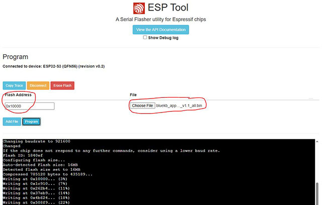

# ESP32-S3 Password Dongle (USB HID Keyboard)

## Overview

This project is a quick prototype (built in about a day) of a tool that makes it easier to send passwords from a mobile password vault app to a PC or device **without having to type them manually**.  

It works as a **USB HID keyboard emulator** running on an ESP32-S3 dongle. The dongle receives keystrokes over Bluetooth and then "types" them on the connected host machine.

⚠️ **Disclaimer:** This project is experimental. While basic testing has been done, bugs or quirks are likely. Contributions and improvements are welcome.

---

## Hardware

- **Board:** [LILYGO® T-Dongle-S3 ESP32-S3 TTGO Development Board](https://github.com/Xinyuan-LilyGO/T-Dongle-S3)  
  - Features: 0.96" ST7735 LCD display, TF card slot, onboard LED  
  - Price: ~$30 on Amazon, ~$17 on AliExpress
    

---

## Features

- Emulates a **USB HID keyboard** when plugged in.
  - ⚠️ Subject to host OS keyboard layout. For correct special characters, flash the firmware with the appropriate layout.
- Advertises as a **Bluetooth device** for pairing and communication. The key will show up in your Bluetooth devices as "KPKB_SRV01"
  - Secure pairing: a PIN is displayed on the dongle screen.
  - Screen feedback:
    - `SECURED` → pairing successful  
    - `READY` → idle state  
    - `RECV: <msg count>` → message received
- LED feedback:
  - Green when remote connects  
  - Blinks when a string is received
- Screen displays "READY" when idle.

 

---

## Firmware Notes

- **Arduino IDE** was used for development.  
- Works reliably with **ESP32 board library v2.0.14**.  
  - ⚠️ Newer versions (ESP32 3.x) caused boot loops with the display.  
  - Downside: BLE stack uses only 128-bit encryption.  
- Possible future improvement: update to latest ESP32 core.

---

## Installation

Precompiled firmware (for various layouts, though only UK tested) is available under **[Releases](./releases)**.

1. Open [esptool-js](https://espressif.github.io/esptool-js/) in your browser.
2. Connect the dongle via USB.
3. Flash the firmware at **address `0x10000`**.

Alternative flashing tools:  
- [T-Dongle-S3 firmware tools](https://github.com/Xinyuan-LilyGO/T-Dongle-S3/tree/main/firmware) (not tested here).

---

## Testing

- Use any **BLE Terminal app** (Android/iOS) to connect and send test messages.  
- Messages will be typed out on the host machine as if from a keyboard.

---

## Integration with Password Vaults

A modified KeePassDX client for Android has been created:  
- Repo: [KeePassDX-kb](https://github.com/larrylart/KeePassDX-kb)  
- Includes an **unsigned APK** for manual install and testing.  
- Notes:
  - Only lightly tested.  
  - Known quirks: sometimes fails to connect or send. Restart KeePassDX if this happens.  
  - This was a quick hack (half a day of work).

---

## Development Setup (Arduino IDE)

### Requirements

- **ESP32 Board Library**: `2.0.14`  
- Additional libraries:
  - `Adafruit_SPIFlash`
  - `FastLED`
  - `NimBLE-Arduino`
  - `TFT_eSPI` (customized)

### TFT Screen

- The stock `TFT_eSPI` in Arduino IDE did not work.  
- Instead, use the version provided by LilyGO:  
  - [T-Dongle-S3 libs](https://github.com/Xinyuan-LilyGO/T-Dongle-S3/tree/main/lib)  
  - Copy `TFT_eSPI` and `lv_conf.h` manually into your Arduino `libraries/` folder.

---

## Screenshots

*(Add images here of the dongle screen, pairing, and typing in action)*

---

## Roadmap / To Do

- Update to ESP32 3.x core without boot loop issues.
- Once getting ESP32 3.x core to run, update Bluetooth stack to avail of latest encryption
- Improve Android app integration & stability.  
- Support additional keyboard layouts (Mac, DE, FR, etc.).  
- Explore secure BLE with stronger encryption.

