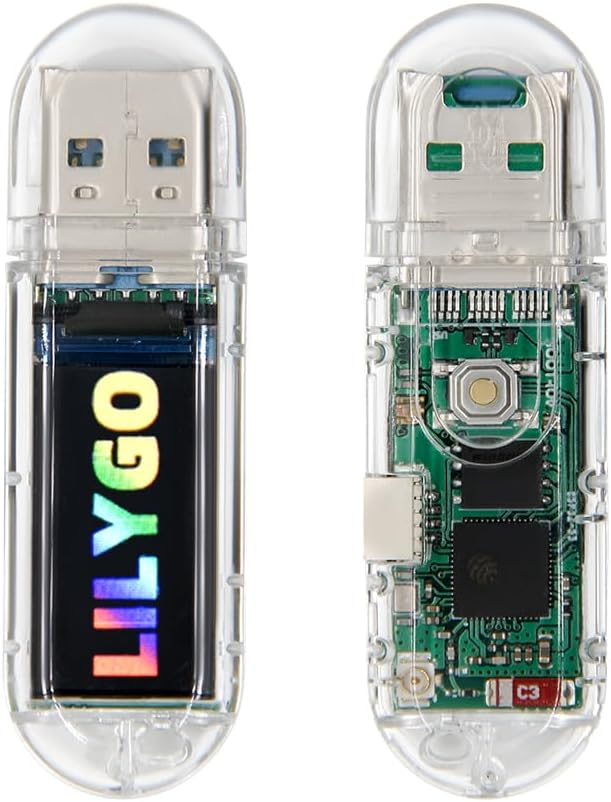

# ESP32-S3 Password Dongle (USB HID Keyboard)

## 🔄 Update

### **v1.1.2 – Blue Keyboard Dongle**

- fixed/enforce unique gonding/pairing to the first device. Any other device that will try to bond after will be rejected.
- to reset dongle pairing to default hold the back button on for 6+ seconds, until you see on the screen "RESET". Than the dongle will quickly restart and was in "READY" you can pair to a diferent device.

### **v1.1 – Blue Keyboard Dongle**

**Release Highlights:**

- 🚀 **Updated to ESP32 Board Library v3.3.1**  
  Migrated firmware to the latest ESP32 core for improved stability and compatibility.  

- 🔐 **Enhanced BLE Security**  
  Refined pairing and encryption logic for more reliable and secure device connections.  

- 🧩 **Micro Command Support**  
  Introduced a new *command protocol* (e.g., `C:SET:LAYOUT_UK_WINLIN`, `S:mystring`) enabling the connected app to dynamically switch keyboard layouts — eliminating the need for separate firmware versions per layout.  

- 🌍 **Additional Keyboard Layouts**  
  Added multiple new regional layouts (DE, FR, ES, IT, PT, SE, NO, DK, FI, CH, TR, etc.) for broader international support *(pending testing)*.  

- 🧠 **Improved Connection & Display Handling**  
  Fixed several issues related to BLE reconnection logic, status feedback, and display updates during connect/disconnect events.  

  
## Overview

This project is a quick prototype of a tool that makes it easier to send passwords from a mobile password vault app to a PC or device **without having to type them manually**.  

It works as a **USB HID keyboard emulator** running on an ESP32-S3 dongle. The dongle receives keystrokes over Bluetooth and then "types" them on the connected host machine.

⚠️ **Disclaimer:** This project is experimental. While basic testing has been done, bugs or quirks are likely. Contributions and improvements are welcome.

---

## Hardware

- **Board:** [LILYGO® T-Dongle-S3 ESP32-S3 TTGO Development Board](https://github.com/Xinyuan-LilyGO/T-Dongle-S3)  
  - Features: 0.96" ST7735 LCD display, TF card slot, onboard LED  
  - Price: ~$30 on Amazon, ~$17 on AliExpress
    

---

## Features

- Emulates a **USB HID keyboard** when plugged in.
  - ⚠️ Subject to host OS keyboard layout. For correct special characters, layout - you need to select the from within the remote app (ie KeePassDX) the host keyboard layout. 
- Advertises as a **Bluetooth device** for pairing and communication. The key will show up in your Bluetooth devices as "KPKB_SRV01"
  - Secure pairing: a PIN is displayed on the dongle screen.
  - Screen feedback:
    - `SECURED` → pairing successful  
    - `READY` → idle state  
    - `RECV: <msg count>` → message received
- LED feedback:
  - Green when remote connects  
  - Blinks when a string is received
- Screen displays "READY" when idle.

 

---

## Firmware Notes (v1.1)

- **Arduino IDE** was used for development.  
- was updated successfully to the latest version **ESP32 board library v3.x**

---

## Installation

Precompiled firmware is available under **[Releases](https://github.com/larrylart/blue_keyboard/releases)**.
Note: use the latest (ie v1.1+) that is more secure and can handle multiple keyboard layouts in the same firmware.

1. Open [esptool-js](https://espressif.github.io/esptool-js/) in your browser.
2. Connect the dongle via USB. Make sure you hold the back dongle button while you inserting in the usb port.
3. Flash the firmware at **address `0x10000`**.


Alternative flashing tools:  
- [T-Dongle-S3 firmware tools](https://github.com/Xinyuan-LilyGO/T-Dongle-S3/tree/main/firmware) (not tested here).

---

## Testing

- Use any **BLE Terminal app** (Android/iOS) to connect and send test messages.  
- Messages will be typed out on the host machine as if from a keyboard.

---

## Integration with Password Vaults

A modified KeePassDX client for Android has been created:  
- Repo: [KeePassDX-kb](https://github.com/larrylart/KeePassDX-kb)  
- Includes an **unsigned APK** for manual install and testing.  
- Notes:
  - Only lightly tested.  
  - Known quirks: sometimes fails to connect or send. Restart KeePassDX if this happens.  
  - This was a quick hack (half a day of work).

---

## Development Setup (Arduino IDE)

### Requirements

- **ESP32 Board Library**: `3.3.1+`  
- Additional libraries:
  - `Adafruit_SPIFlash`
  - `FastLED`
  - `NimBLE-Arduino`
  - `TFT_eSPI` (customized)


### TFT Screen

- The stock `TFT_eSPI` in Arduino IDE did not work out of the box  
- You need to get the one provided by LilyGO:  
  - [T-Dongle-S3 libs](https://github.com/Xinyuan-LilyGO/T-Dongle-S3/tree/main/lib)  
  - Copy from LilyGO TFT_eSPI/User_Setup.h, TFT_eSPI/User_Setup_Select.h, User_Setups directory your Arduino `libraries/TFT_eSPI` folder.
  - also copy LilyGO `lv_conf.h` manually into your Arduino `libraries/` folder.
  - edit `libraries/TFT_eSPI\User_Setups\Setup47_ST7735.h` and add these lines:
  ```
  #define USE_HSPI_PORT // fix for t-dongle-s3 with newer board versions
  #define DISABLE_ALL_LIBRARY_WARNINGS //disable touch gpio warnings.
  ```

---

## Roadmap / To Do

- Improve Android app integration & stability.  
- Explore options to tokenize strings in transit
- Tidy up the code, restructure

