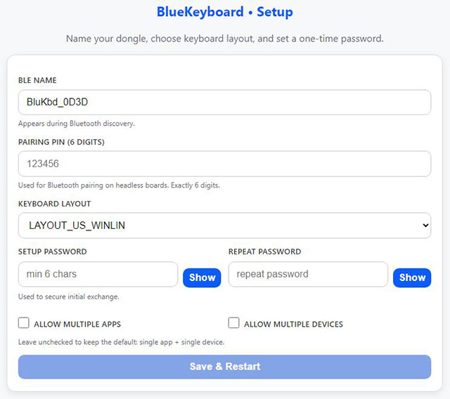
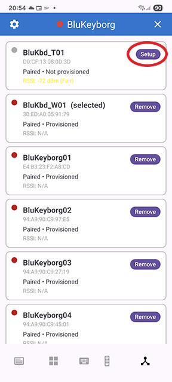

# Setup Guide 

This guide covers **first-time setup** for **Blue Keyboard / BluKeyborg dongles** (both **with** and **without** a display).

> **Note:**  
> Dongles **without a display** follow the same setup flow, with two small exceptions
> (Wi-Fi password and BLE pairing PIN), which are clearly marked below.

It includes:
- Flashing firmware
- First boot Wi-Fi portal setup (AP mode)
- Pairing / provisioning with BluKeyborg

---

## 📥 Firmware Installation

Precompiled firmware is available under  
**[Releases](https://github.com/larrylart/blue_keyboard/releases)**.

1. Open **[esptool-js](https://espressif.github.io/esptool-js/)** in your browser.  
2. Connect the dongle via USB **while holding the back button** to enter bootloader mode.  
3. Flash the provided firmware binary at **address `0x0`**.

4. Wait until esptool-js finishes (it takes about **2 minutes** to write and verify).  
   When done, you should see something like this at the bottom:

### Alternative flashing tools

- LilyGO **T-Dongle-S3 firmware tools** (not tested):  
  https://github.com/Xinyuan-LilyGO/T-Dongle-S3/tree/main/firmware

---

## 🛠️ First Boot Setup (Wi-Fi AP Mode)

### 1) Wi-Fi configuration portal

On **first start**, **after flashing**, or **after a factory reset**, the dongle starts a
Wi-Fi configuration portal:

- Starts a Wi-Fi Access Point: **`BLUKBD-XXXX`**  
  (`XXXX` = last 2 bytes of the MAC address)
- **Dongles with display:**  
  Shows a **random AP password** on the TFT screen  
  *(Unplugging and plugging the dongle again generates a new password.)*
- **Dongles without display:**  
  Uses this **fixed Wi-Fi password**: **b1uk3b0rd**  
  This is intentional compromise, as Wi-Fi AP mode is only active briefly during setup and is
  typically done in a private environment. The security exposure is negligible.  
- Starts a small HTTP server + DNS captive portal at **`192.168.4.1`**

---

### 2) Connect to the AP

Note: **Display-equipped dongles:** v2.1.0 adds on-device **QR code access** for Wi-Fi and setup. The QR code can be shown from the **password / IP screen** using the **Back / User button**. 
First QR code (from password screen) will allow you to connect to the dongle's wifi AP, second QR code (from IP screen) will open the browser straight to the setup page. 

On your phone or PC:

1. Scan for Wi-Fi networks
2. Connect to **`BLUKBD-XXXX`** using the password shown on the dongle screen
3. Once connected, the dongle will display its IP address on screen  
   (usually **`192.168.4.1`**, if a display is present)

Captive portal auto-redirect is inconsistent on some operating systems.  
If it does not redirect automatically, open:

- http://192.168.4.1

---

### 3) Configure the dongle

On the setup page, configure:

- **Bluetooth Name**  
  The name shown during BLE scanning. Useful if you have multiple dongles.

- **Host Keyboard Layout**  
  The keyboard layout of the PC/Mac the dongle types into.  
  *(This can also be changed later in the app.)*

- **Setup Password**  
  Used to derive the PBKDF2 verifier for secure AppKey onboarding.

- **Allow multiple apps/devices** (optional)  
  For extra security, by default the dongle limits access to **one app** and
  **one paired device**.  
  Enable these options only if you intend to use the dongle with multiple devices
  or multiple apps.

- **BLE Pairing PIN** *(dongles without display only)*  
Required because the dongle cannot show a pairing code on-screen.  
This PIN will be used during the initial Bluetooth pairing step.

Press **Save**. The dongle will:

- Store all values in NVS
- Generate the AppKey
- Mark setup as complete
- Reboot into normal **BLE + USB HID** mode
- Disable Wi-Fi and setup services permanently  
  *(unless the device is factory reset)*

---

## Reset Back Into Setup Mode (Factory Reset)

If you need to return to Wi-Fi setup mode at any time (e.g. pairing or provisioning failure),
you can reset the dongle to defaults.

- **Short press** the dongle button once, then immediately **long press** for **3+ seconds**
- The screen will show **"RESET"**, and the device will reboot into Wi-Fi setup mode

This resets:
- BLE pairing
- All settings
- mTLS keys / session material
- Everything stored in NVS related to setup and provisioning

---

## Pairing & Provisioning with BluKeyborg App

Once setup is complete, the dongle runs in normal mode and is ready to be paired and provisioned.

Open the **BluKeyborg app**:

**Devices → tap _Setup_ on your dongle entry**, then follow the on-screen instructions.

- The app will first ask you to pair the dongle, if it is not already paired
- A pop-up will then request the **setup password** you configured in the Wi-Fi portal
- If any step fails, retry, or fully close the app and start the setup again

If the dongle was previously configured (before a factory reset, password change, etc.),
it is recommended to:

1. Remove the dongle from the app
2. Close the app
3. Remove the BLE pairing from Android / iOS system settings
4. Reopen the app and start setup from scratch

This ensures all old credentials are cleared.  
If needed, uninstalling and reinstalling the app also guarantees a clean start.

After the password is verified and the AppKey is provisioned, the dongle is fully paired
and ready for normal use.

---

## Troubleshooting

### Portal doesn’t open automatically
Manually open http://192.168.4.1 after joining the Wi-Fi AP **`BLUKBD-XXXX`**.

### Can’t see the AP network
- Ensure the dongle is in setup mode (factory reset if unsure)
- Move closer to the dongle / reduce Wi-Fi congestion
